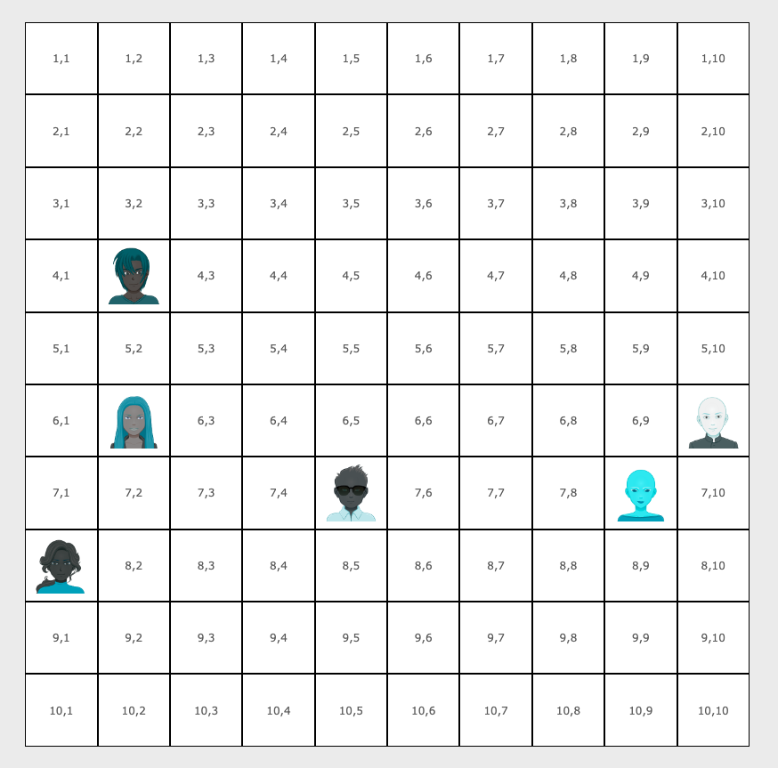

# Support tableaux & boucles PHP

1. À l'aide de boucles PHP, créer une grille de 10 lignes x 10 colonnes. Utiliser les classes CSS `.row` et `.cell` déjà prêtes à l'emploi.
2. Des images de personnages sont présentes dans le dossier **/images**. Créer un tableau PHP multidimensionnel contenant pour chaque personnage :
   - le nom
   - une coordonnée X
   - une coordonnée Y
3. Placer les personnages sur la grille en fonction de leurs coordonnées X et Y
4. Refacto du placement des personnages à l'aide d'une fonction

